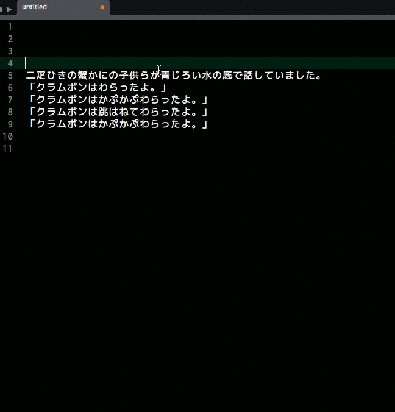

# KanaKana
KanaKana is plugin of Hiragana/Katakana converter for Sublime Text 3.




## Installation
#### Install via [Package Control](https://packagecontrol.io) for Sublime Text 3
0. Open the command palette with <kbd>Cmd + Shift + P</kbd> or <kbd>Ctrl + Shift + P</kbd>
0. Select ```Package Control: Install Package```
0. Select ```KanaKana``` and install.

#### Install via git
0. In a terminal, navigate to Sublime Text 3 Packages directory
    - e.g. on OS X: ```~/Library/Application Support/Sublime Text 3/Packages```
0. run ```git clone https://github.com/mitsu-ksgr/KanaKana.git```


## Usage
#### Context Menu
0. Select the range you want to convert.
0. Right-click on your document, open the context menu.
0. Select ```かな/カナ```.
0. Select the menu that you want.
    - ```Convet to かな``` - katakana in selected ranges convert to hiragana.
    - ```Convet to カナ``` - hiragana in selected ranges convert to katakana.
    - ```Invert かな/カナ``` - Inverts Hiragana/Katakamuna in selected ranges.

#### Command Palette
0. Select the range you want to convert.
0. Open the command palette with <kbd>Cmd + Shift + P</kbd> or <kbd>Ctrl + Shift + P</kbd>
0. Type following commands.
    - ```Convet to Hiragana``` - katakana in selected ranges convert to hiragana.
    - ```Convet to Katakana``` - hiragana in selected ranges convert to katakana.
    - ```Invert Hiragana/Katakana``` - Inverts Hiragana/Katakamuna in selected ranges.


## License
MIT License

